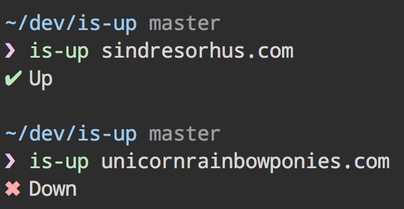

# is-up [](https://travis-ci.org/sindresorhus/is-up)

> Check whether a website is up or down using the [isitup.org](http://isitup.org) API




## CLI

```
$ npm install --global is-up
```

```
$ is-up --help

  Example
    is-up sindresorhus.com
    ✔︎ Up
```


## API

```
$ npm install --save is-up
```

```js
const isUp = require('is-up');

isUp('sindresorhus.com').then(up => {
	console.log(up);
	//=> true
});
```


## License

MIT © [Sindre Sorhus](http://sindresorhus.com)
